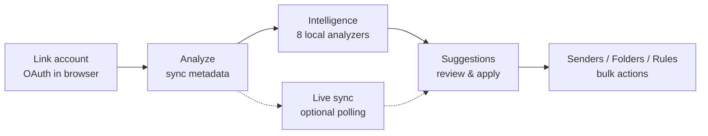
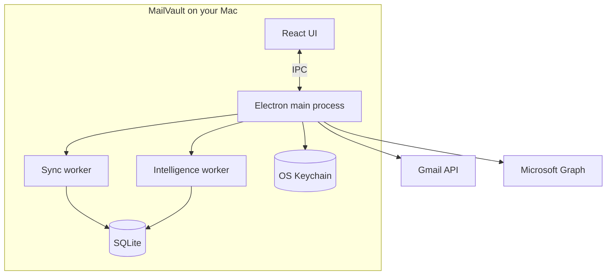

<p align="center">
  
</p>

<p align="center">
  <strong>Your inbox. Finally under control.</strong><br />
  A desktop command center for cleaning up Gmail and Outlook — not an email client.
</p>

<p align="center">
  <code>local-only</code> · <code>no cloud</code> · <code>no telemetry</code> · <code>OAuth2</code> · <code>macOS 13+</code>
</p>

---

## Contents

- [What is MailVault?](#what-is-mailvault)
- [How it works](#how-it-works)
- [Quick start](#quick-start)
- [Using the app](#using-the-app)
- [Connect Gmail or Outlook](#connect-gmail-or-outlook)
- [Build & share (macOS)](#build--share-macos)
- [Troubleshooting](#troubleshooting)
- [For developers](#for-developers)

---

## What is MailVault?

MailVault connects **directly** to Gmail and Microsoft Outlook (via Microsoft Graph). It does not host your mail, sync to a cloud backend, or read your email passwords.

You use it to:

| Goal | Where in the app |
| --- | --- |
| See inbox health at a glance | **Dashboard** — KPIs, charts, quick actions |
| Get smart cleanup ideas | **Suggestions** — newsletters, bulk senders, junk rescue, folder/rule ideas |
| Scan a time range of mail | **Analyze** — pick 7 days → all time, watch progress live |
| Bulk-delete or move by sender | **Senders** — grouped view with multi-select |
| Browse folders & messages | **Mailbox** — tree + list (open from Dashboard, Folders, or sidebar) |
| Organize with folders & rules | **Folders** · **Rules** · **Blocked** |
| Stay on top of new mail | **Live sync** (optional) — background polling + approval queue |
| Make it yours | **Personalization** — themes, layout, density (`⌘,`) |

Link up to **4 accounts** (any mix of Gmail and Outlook). Everything stays on your Mac: tokens in the **Keychain**, analysis in **local SQLite**.

> MailVault is built with Electron, React, and TypeScript. Brand assets: [`resources/medias/BRAND_GUIDE.md`](resources/medias/BRAND_GUIDE.md).

---

## How it works



**Sync** fetches message *metadata* (sender, subject, date, size — not full bodies) into a local database. **Intelligence** runs entirely on that snapshot — no extra API calls. **Live sync** can watch for new mail in the background and queue actions for your approval.



---

## Quick start

### Prerequisites

| Requirement | Notes |
| --- | --- |
| **macOS 13+** | Apple Silicon or Intel — primary platform |
| **Node.js 18+** | `brew install node` or [nodejs.org](https://nodejs.org) |
| **Git** | To clone the repo |
| **OAuth credentials** | Free Google and/or Microsoft app registration — [below](#connect-gmail-or-outlook) |

### 1 · Install

```bash
git clone https://github.com/<you>/mailvault.git
cd mailvault
npm install
cp .env.example .env
```

`npm install` rebuilds native modules (`keytar`, `better-sqlite3`) for Electron and applies macOS branding patches.

### 2 · Configure OAuth

Edit `.env` with at least one provider (see [Connect Gmail or Outlook](#connect-gmail-or-outlook)):

```env
VITE_GOOGLE_CLIENT_ID=
VITE_GOOGLE_CLIENT_SECRET=
VITE_MICROSOFT_CLIENT_ID=
```

You can start with one provider and add the other later.

### 3 · Run

```bash
npm run dev
```

Vite serves the UI at `http://localhost:5173` and launches the Electron shell.

**First launch**

1. **Create a local MailVault account** — username + password, stored hashed in `~/Library/Application Support/MailVault/users.db`.
2. **Personalization wizard** (optional) — pick a theme and layout.
3. **Link email** — click **+ Add** → Google or Outlook. Consent happens in your browser; MailVault catches the redirect on `http://127.0.0.1:<port>`.
4. **Onboarding tour** — ~2 minutes; press `⌘⇧?` anytime to replay.
5. **Analyze** — choose a time range (first time: **1 year** is a good balance), press **Start** or `S`.

---

## Using the app

### Recommended workflow

```
Link account  →  Analyze (time range)  →  Review Suggestions  →  Clean up in Senders
                      ↓
              Enable Live sync (Settings) for ongoing triage
```

| Step | Action |
| --- | --- |
| **1. Analyze** | Sidebar → **Analyze** → pick range → start sync. Progress appears in the **Sync Drawer** (`⌘J` to toggle). |
| **2. Suggestions** | After sync, intelligence runs automatically. Open **Suggestions** to review grouped ideas and apply actions. |
| **3. Senders** | **Senders** shows every sender in the synced range. Select rows → delete, move, or block in bulk. |
| **4. Folders & rules** | **Folders** for smart folder ideas; **Rules** to automate routing; **Blocked** for senders you never want again. |
| **5. Live sync** | **Settings → Live sync** — background polling, notification bell for items needing approval. |

### Main screens

| Key | Screen | Purpose |
| --- | --- | --- |
| `1` | Dashboard | Overview, charts, jump-off points |
| `2` | Suggestions | Intelligence feed |
| `3` | Analyze | Sync controls + time range |
| `4` | Senders | Bulk cleanup by sender |
| `5` | Folders | Folder tree + suggestions |
| `6` | Rules | Rule builder |
| `7` | Blocked | Blocked senders |
| `8` | Settings | General, live sync, appearance, accounts, help |

**Mailbox** opens when you pick a folder from the sidebar or Dashboard — it is not a numbered nav item.

### Keyboard shortcuts

| Keys | Action |
| --- | --- |
| `1`–`8` | Navigate main screens |
| `⌘1`–`⌘4` | Switch linked email account |
| `⌘,` | Personalization panel |
| `S` | Start sync (from Analyze) |
| `⇧C` | Cancel running sync |
| `⌘J` | Toggle sync drawer |
| `⌘D` | Toggle compact density |
| `⌘Z` | Undo last bulk delete (when toast is active) |
| `?` | Shortcuts overlay |
| `⌘⇧?` | Replay onboarding tour |
| `Esc` | Close modal / clear selection |

### Settings overview

| Tab | What you configure |
| --- | --- |
| **General** | App behavior and defaults |
| **Live sync** | Polling interval, auto-actions, approvals |
| **Appearance** | Themes, accent, layout, sidebar order, density |
| **Accounts** | Linked Gmail/Outlook accounts (max 4) |
| **Help** | Docs links, replay tour, what’s new |

### Privacy & data

| Data | Where it lives |
| --- | --- |
| OAuth tokens | macOS Keychain (`com.mailvault.app`) — never plaintext on disk |
| MailVault login | SQLite `users.db` — bcrypt-hashed password |
| Sync & suggestions | Per-account SQLite under Application Support |
| Preferences | Encrypted `electron-store` metadata |
| Your mail bodies | **Not stored** — only metadata fetched for analysis |

Closing the app signs you out of MailVault; linked email tokens remain in the Keychain for next launch.

---

## Connect Gmail or Outlook

<details>
<summary><strong>Google (Gmail)</strong></summary>

1. [Google Cloud Console](https://console.cloud.google.com/) → create or select a project.
2. **APIs & Services → Library** → enable **Gmail API**.
3. **OAuth consent screen**:
   - User type: **External**
   - Scopes: `gmail.readonly`, `gmail.modify`, `gmail.settings.basic`
   - Add **your Gmail as a Test User**
   - Leave status **Testing** (no verification needed for personal use)
4. **Credentials → Create → OAuth client ID** → **Desktop app**
5. Copy **Client ID** and **Client Secret** into `.env`:

```env
VITE_GOOGLE_CLIENT_ID=<id>.apps.googleusercontent.com
VITE_GOOGLE_CLIENT_SECRET=<secret>
```

> The desktop client secret is bundled in the app binary — it identifies the app, not you. PKCE protects the authorization code exchange.

</details>

<details>
<summary><strong>Microsoft (Outlook / Hotmail / Live / 365)</strong></summary>

1. [Azure Portal](https://portal.azure.com) → **Microsoft Entra ID → App registrations → New**.
2. Name: `MailVault`. Account types: **"Accounts in any organizational directory and personal Microsoft accounts"** — required for `@outlook.com`, `@hotmail.com`, `@live.com`.
3. **Authentication → Mobile and desktop** → add redirect `http://localhost` (any loopback port works at runtime).
4. **API permissions → Microsoft Graph → Delegated**:
   - `openid`, `profile`, `email`, `offline_access`
   - `Mail.Read`, `Mail.ReadWrite`
   - `MailboxSettings.Read`, `MailboxSettings.ReadWrite`
   - `User.Read`
5. **Do not** create a client secret — desktop apps use PKCE.
6. Copy **Application (client) ID**:

```env
VITE_MICROSOFT_CLIENT_ID=<application-client-id>
```

> MailVault uses the `/consumers/` tenant so personal Microsoft accounts work reliably.

</details>

---

## Build & share (macOS)

### Development build

```bash
npm run build          # compile TypeScript + Vite
npm run package:mac    # .app + .dmg (arm64 + x64)
```

Or use the interactive script:

```bash
chmod +x scripts/build-mac.sh
./scripts/build-mac.sh
```

**Output**

| Artifact | Path |
| --- | --- |
| App bundle | `release/mac-universal/MailVault.app` (or `mac-arm64/`) |
| Installer | `release/MailVault-<version>.dmg` |

### One-command deploy

```bash
chmod +x scripts/install-cli.sh
./scripts/install-cli.sh

mailvault-deploy                  # bump patch, build, install to /Applications
mailvault-deploy --minor
mailvault-deploy --no-version-bump
```

Equivalent: `npm run deploy`, `npm run deploy:dry`, etc.

### Share with another Mac

1. Send the `.dmg` or zip `MailVault.app`.
2. Recipient drags to **Applications**.
3. First launch on unsigned builds: **right-click → Open**, or `xattr -cr /Applications/MailVault.app`.
4. They create their **own** local MailVault account and link **their** OAuth accounts — nothing is synced between machines.

### Code signing (optional)

Export `APPLE_ID`, `APPLE_APP_SPECIFIC_PASSWORD`, and `APPLE_TEAM_ID` before building to sign and notarize. See `scripts/notarize.js`.

---

## Troubleshooting

<details>
<summary><strong>Auth & OAuth errors</strong></summary>

| Symptom | Fix |
| --- | --- |
| Google **Access blocked — app not verified** | Add your email under OAuth consent screen → **Test users** |
| Microsoft **AADSTS50020** (tenant) | App registration must allow personal accounts; MailVault uses `/consumers/` |
| Microsoft **AADSTS65001** (consent) | Reconnect and accept all requested permissions |
| Google missing `refresh_token` | Revoke at [myaccount.google.com/permissions](https://myaccount.google.com/permissions), reconnect |
| **Needs reconnect** banner | Click **Reconnect** — token revoked (password change, idle, security alert) |
| Keychain prompt every launch | Click **Always Allow** once |

</details>

<details>
<summary><strong>Build & deploy errors</strong></summary>

| Issue | Fix |
| --- | --- |
| `mailvault-deploy` not found | Run `./scripts/install-cli.sh` |
| TypeScript errors | `npx tsc --noEmit` and `npx tsc -p tsconfig.node.json --noEmit` |
| Vite build failed | `npm run build:renderer` |
| electron-builder failed | `cat .deploy-log` — often missing `entitlements.mac.plist` or icon; run `npm run gen-icons` |
| Grey Electron dock icon | `npm run gen-icons` then rebuild |
| Native module errors | `npm run rebuild` |
| Gatekeeper blocks app | `xattr -cr /Applications/MailVault.app` |

</details>

<details>
<summary><strong>CLI hangs on user test</strong></summary>

```bash
npm run rebuild
npm run cli -- --test=user
```

</details>

---

## For developers

### npm scripts

| Script | Purpose |
| --- | --- |
| `npm run dev` | Dev server + Electron |
| `npm run build` | Production compile |
| `npm run cli` | OAuth/API smoke tests (no GUI) |
| `npm run cli:fast` | CLI with dev build |
| `npm run lint` | ESLint |
| `npm run rebuild` | Rebuild native modules for Electron |
| `npm run gen-icons` | SVG → `assets/icon.icns` |
| `npm run deploy` | Full deploy pipeline |

### CLI test mode

Same OAuth and API code paths as the GUI; writes real tokens to your Keychain.

```bash
npm run cli -- --test=user
npm run cli -- --test=auth:google
npm run cli -- --test=auth:microsoft
npm run cli -- --test=api:gmail
npm run cli -- --test=api:microsoft
npm run cli -- --test=all
```

Entry point: `electron dist-electron/main.js --cli` (no window).

### Sync pipeline

`syncEngine.ts` spawns `workers/syncWorker.ts`:

| Stage | UI label | Work |
| --- | --- | --- |
| 1 | Probing mailbox | Volume estimate / incremental cursor |
| 2 | Fetching metadata | Gmail `/batch` (100/call); Graph pages + `$batch` (20/call) |
| 3 | Grouping by sender | Cluster → `syncDb` SQLite |
| 4 | Analyzing patterns | Newsletters, categories, storage totals |
| 5 | Finalizing & indexing | Folder hints + Senders/Dashboard index |

Supports incremental sync, per-account concurrency guard, and cancel between batches.

### Intelligence

After sync, `intelligenceEngine.ts` runs eight analyzers in `intelligenceWorker.ts`: bulk senders, newsletters, junk rescue, folder suggestions, rule suggestions, large attachments, inbox clutter, sender trust. Results land in **Suggestions**.

### Live sync

`liveSyncEngine.ts` polls when enabled. `incomingAnalyzer.ts` classifies new mail; `autoActionEngine.ts` runs high-confidence actions or queues approvals.

### Project layout

```
mailvault/
├── electron/          # main process, auth, services, workers, cli
├── src/               # React renderer, stores, components
├── shared/types.ts    # IPC + domain types
├── assets/brand/      # shipped SVG logos
├── resources/medias/  # source assets + BRAND_GUIDE.md
└── scripts/           # build, deploy, icons
```

### Architecture notes

- Renderer is sandboxed; privileged I/O stays in main via `window.mailvault` (`preload.ts`).
- Workers never import Electron or keytar — token refresh round-trips to main.
- Gmail bulk trash uses `batchModify` (1000 ids/call); metadata via HTTP `/batch`.
- Sessions are in-memory; closing the app signs out the MailVault user.

### Caveats

- Gmail `sizeEstimate` is exact; Graph approximates from headers + preview.
- Rules are a normalized model — not every action maps 1:1 on both providers.
- Suggestions reflect the **last sync snapshot** — run Analyze for fresh data.
- Packaging targets exist for Windows/Linux; **macOS 13+ is actively supported**.

---

## License

MIT
